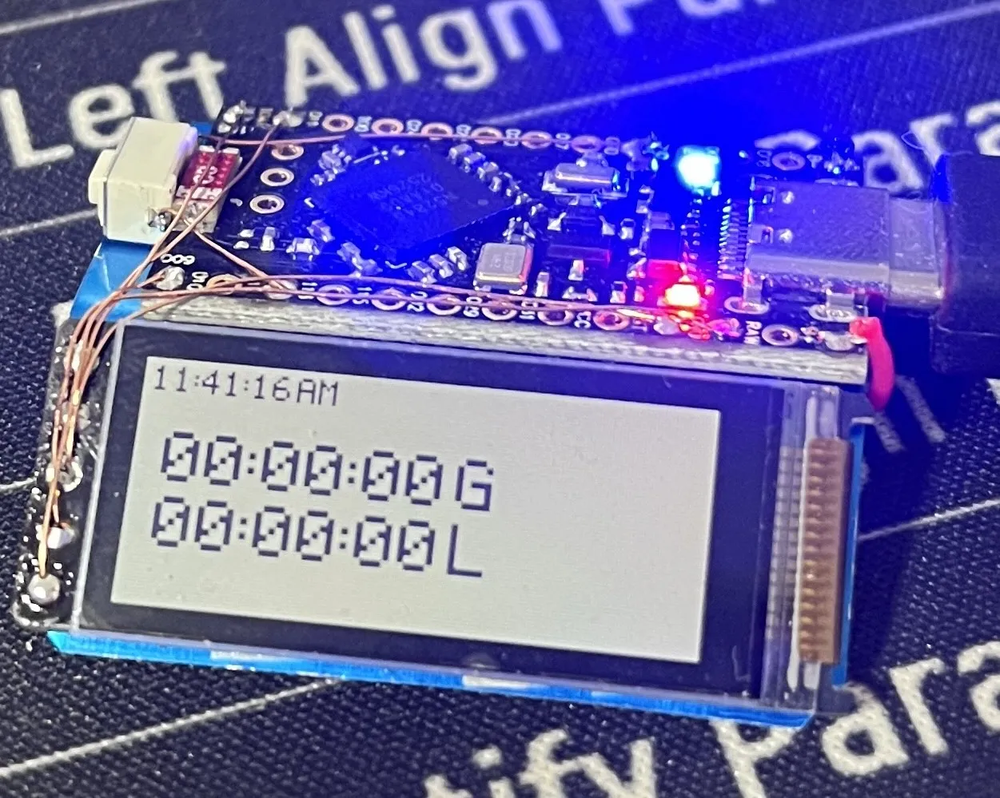

# geekwatch Firmware

geekwatch is a device and a service that help you stay productive! The hardware keeps track of how long you spend working and geeking, bothers you verbally when you are geeking for too long, and connects via bluetooth to a computer or smartphone to log your data. Logged data is then available on the soon-to-exist geek.watch web app where you can compete with your friends and maximize productivity.

## Hardware (v1)

- **MCU**: nRF52840 ProMicro board (with Adafruit UF2 bootloader)
- **Display**: LS011B7DH03 160x68 Sharp Memory Display (SPI)
- **Audio**: MAX98357A I2S audio amplifier + speaker
- **Power**: USB-C charging, LiPo battery (TBD)



v2 hardware currently

### To Do
- Audio reminders
- Battery monitoring and power management
- BLE connectivity
- Data logging to the geekwatch web app
- Improved font face

## Development Setup

### Prerequisites

- [PlatformIO](https://platformio.org/) (VS Code extension or CLI)
- USB cable for programming via UF2 bootloader

### Building the Firmware

```bash
# Build the project
pio run

# Build and upload via UF2 bootloader
# 1. Double-tap reset button on nRF52840 ProMicro to enter bootloader mode
# 2. Board will appear as USB drive (e.g., "PROMICROBOOT")
# 3. Run upload command:
pio run --target upload

# Monitor serial output
pio device monitor
```

### Project Structure

```
geekwatch-firmware/
├── boards/
│   └── nrf52840_promicro.json    # Custom board definition
├── include/
│   ├── config.h                   # Hardware configuration
│   ├── display_sharp.h            # Sharp Memory Display driver header
│   ├── display.h                  # Display driver header (legacy)
│   ├── display_simple.h           # Simple display header (legacy)
│   └── audio.h                    # Audio driver header
├── src/
│   ├── main.cpp                   # Main application (stopwatch mode)
│   └── display_sharp.cpp          # Sharp Memory Display driver
├── platformio.ini                 # PlatformIO configuration
├── test_serial.py                 # Serial testing utility
├── convert_uf2.sh                 # UF2 conversion script
├── uf2conv.py                     # UF2 converter
└── README.md
```

## Pin Configuration

Verify these pin assignments match your hardware wiring:

### Display (SPI)
- SCK: Pin 13
- MOSI: Pin 12
- CS: Pin 11

### Audio (I2S)
- SCK (BCLK): Pin 26
- LRCK (WS): Pin 25
- DIN (SD): Pin 27

Edit [include/config.h](include/config.h) to modify pin assignments.

## Current Status

### Implemented
- PlatformIO project structure
- Custom nRF52840 ProMicro board definition
- Sharp Memory Display (LS011B7DH03) driver with full SPI communication
- Pixel-level drawing and framebuffer management
- Custom 5x7 bitmap font for digits and characters
- Complete stopwatch application with:
  - Dual independent stopwatches (hours:minutes:seconds)
  - Real-time clock display (HH:MM:SS AM/PM)
  - Button control with debouncing and long-press detection
  - Stopwatch switching via button press
  - Reset confirmation with 3-second timeout
  - Active stopwatch indicator
  - VCOM toggle for Sharp display

## Flashing Instructions

### Via UF2 Bootloader (Recommended)

1. **Enter bootloader mode**:
   - Double-tap the reset button on the nRF52840 ProMicro
   - Board LED should pulse, indicating bootloader mode
   - A USB drive named "NICENANO" will appear as a storage device

2. **Build firmware**:
   ```bash
   pio run
   ```

3. **Flash to device**:
   - Run uf2conv.py
   - Locate the compiled UF2 file in `.pio/build/geekwatch/firmware.uf2`
   - Drag and drop onto the USB drive
   - Board will automatically reset and run new firmware

### Serial Monitor

```bash
pio device monitor
```

Default baud rate: 115200

## Notes

### Button Controls

- **Short Press**: Switch between stopwatches or start first stopwatch
- **Long Press** (>1 second): Show reset confirmation dialog
- **Confirm Reset**: Press button within 3 seconds during confirmation
- Button is configured on P1.11 (pin 43) with internal pull-up

### Display Details

The Sharp Memory Display (LS011B7DH03) driver includes:
- SPI Mode 0 communication at up to 2MHz
- 160×68 pixel monochrome display
- Framebuffer-based rendering
- Custom 5×7 bitmap font for efficient character rendering
- VCOM toggle for display refresh (required by Sharp protocol)

## License

See [LICENSE](LICENSE) file for details.